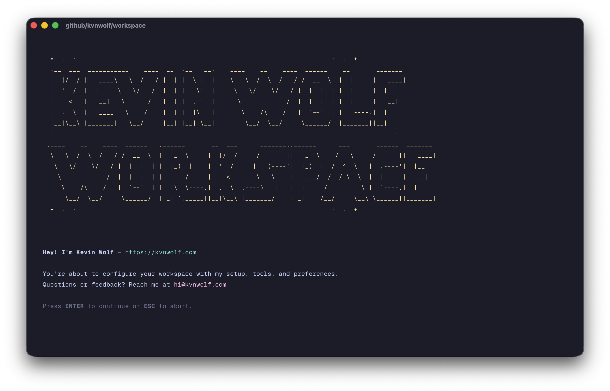

# Kevin Wolf's Workspace



A complete macOS development environment configuration using [GNU Stow](https://www.gnu.org/software/stow/) for symlink management.

## Prerequisites

- macOS (tested on Darwin 25.x)
- Internet connection (for Homebrew packages)
- Admin access (for changing default shell and installing packages)

## Quick Start

```bash
bash <(curl -fsSL https://kvnwolf.com/setup-workspace)
```

The setup script is interactive—each step can be skipped by pressing `ESC`.

## What Gets Installed

### macOS System Defaults

The setup configures these system preferences:

| Setting | Value | Description |
|---------|-------|-------------|
| Dock auto-hide | Enabled | Dock hides automatically |
| Recent apps in Dock | Disabled | Removes recent apps section from Dock |
| File extensions | Visible | Shows all file extensions in Finder |
| Finder view | Column | Sets column view as default |
| Initial key repeat | 15 | Faster initial key repeat |
| Key repeat rate | 2 | Faster key repeat speed |

### CLI Tools

Command-line tools installed via Homebrew. Some are modern replacements for traditional Unix commands.

| Tool | Replaces | Description |
|------|----------|-------------|
| [bat](https://github.com/sharkdp/bat) | `cat` | Syntax highlighting, line numbers, Git integration |
| [btop](https://github.com/aristocratos/btop) | `top` | Beautiful TUI, mouse support, resource graphs |
| [bun](https://bun.sh/) | | JavaScript runtime and toolkit |
| [curlie](https://github.com/rs/curlie) | `curl` | Colored output, httpie-like formatting |
| [difftastic](https://github.com/Wilfred/difftastic) | | Structural diff tool |
| [eza](https://github.com/eza-community/eza) | `ls` | Icons, colors, Git status integration |
| [fd](https://github.com/sharkdp/fd) | `find` | Simpler syntax, respects .gitignore, faster |
| [fish](https://fishshell.com/) | | User-friendly shell |
| [fisher](https://github.com/jorgebucaran/fisher) | | Fish plugin manager |
| [fnm](https://github.com/Schniz/fnm) | | Fast Node.js version manager |
| [fzf](https://github.com/junegunn/fzf) | | Fuzzy finder |
| [gh](https://cli.github.com/) | | GitHub CLI |
| [git-delta](https://github.com/dandavison/delta) | | Syntax-highlighting pager for git |
| [jq](https://jqlang.github.io/jq/) | | JSON processor |
| [lazygit](https://github.com/jesseduffield/lazygit) | | Git TUI |
| [procs](https://github.com/dalance/procs) | `ps` | Colored output, tree view, searchable |
| [ripgrep](https://github.com/BurntSushi/ripgrep) | `grep` | Much faster, respects .gitignore, better defaults |
| [sd](https://github.com/chmln/sd) | | Intuitive find & replace |
| [starship](https://starship.rs/) | | Cross-shell prompt |
| [stow](https://www.gnu.org/software/stow/) | | Symlink farm manager |
| [tldr](https://tldr.sh/) | `man` | Practical examples instead of verbose manuals |
| [tokei](https://github.com/XAMPPRocky/tokei) | | Code statistics |
| [zoxide](https://github.com/ajeetdsouza/zoxide) | | Smarter directory jumping |

### GUI Applications

| Application | Description |
|-------------|-------------|
| [1Password](https://1password.com/) | Password manager |
| [Claude](https://claude.ai/) | AI assistant app |
| [Claude Code](https://claude.ai/code) | AI coding assistant CLI |
| [CleanShot](https://cleanshot.com/) | Screenshot and recording tool |
| [Discord](https://discord.com/) | Communication platform |
| [Ghostty](https://ghostty.org/) | GPU-accelerated terminal |
| [Google Chrome](https://www.google.com/chrome/) | Web browser |
| [LocalXpose](https://localxpose.io/) | Reverse proxy for localhost |
| [OrbStack](https://orbstack.dev/) | Docker & Linux on macOS |
| [Raycast](https://raycast.com/) | Productivity launcher |
| [Superwhisper](https://superwhisper.com/) | Voice-to-text |
| [Vanilla](https://matthewpalmer.net/vanilla/) | Menu bar organizer |
| [Visual Studio Code](https://code.visualstudio.com/) | Code editor |
| [WhatsApp](https://www.whatsapp.com/) | Messaging app |

## Shell Configuration

Fish shell becomes the default shell. Below are all shortcuts and configurations organized by tool.

### Git

**Abbreviations:**

| Abbr | Command | Abbr | Command |
|------|---------|------|---------|
| `g` | `git` | `gp` | `git push` |
| `ga` | `git add` | `gpb` | `git checkout -` |
| `gaa` | `git add --all` | `gpf` | `git push --force-with-lease` |
| `gau` | `git add --update` | `gpr` | `git pull --rebase` |
| `gb` | `git branch` | `grb` | `git rebase` |
| `gba` | `git branch --all` | `grba` | `git rebase --abort` |
| `gbd` | `git branch --delete` | `grbc` | `git rebase --continue` |
| `gbD` | `git branch --delete --force` | `grbi` | `git rebase --interactive` |
| `gc` | `git commit --verbose` | `grh` | `git reset` |
| `gca` | `git commit --verbose --all` | `grhh` | `git reset --hard` |
| `gcam` | `git commit --all --message` | `gss` | `git status --short` |
| `gcb` | `git checkout -b` | `gst` | `git status` |
| `gcmsg` | `git commit --message` | `gsta` | `git stash push` |
| `gco` | `git checkout` | `gstl` | `git stash list` |
| `gd` | `git diff` | `gstp` | `git stash pop` |
| `gds` | `git diff --staged` | `gsw` | `git switch` |
| `gdt` | `git difftool --tool=difftastic` | `gswc` | `git switch --create` |
| `gf` | `git fetch` | `gl` | `git pull` |
| `gfa` | `git fetch --all --tags --prune` | `glog` | `git log --oneline --decorate --graph` |
| `lg` | `lazygit` | `gloga` | `git log --oneline --decorate --graph --all` |

**Functions:**

| Function | Description |
|----------|-------------|
| `gaac "message"` | Add all files and commit with message |
| `gaacp "message"` | Add all, commit, and push |

**Configuration:**

- Default branch: `main`
- Pull strategy: Rebase
- Auto-setup remote: Enabled (push without `-u`)
- Merge conflict style: diff3
- Pager: delta with line numbers and VS Code hyperlinks
- Credential helper: GitHub CLI

### Directory Listing & Navigation

**Abbreviations (using eza):**

All listing commands follow the pattern `l[t][a][f][N]` where:
- `t` = tree view
- `a` = include hidden files (all)
- `f` = full details (permissions, size, etc.)
- `N` = tree depth (only with `t`, default: 1)

| Abbr | Description |
|------|-------------|
| `l` | Compact list with icons |
| `la` | Compact list including hidden files |
| `lf` | Full details |
| `laf` | Full details including hidden files |
| `lt` | Tree view (depth 1) |
| `lt3` | Tree view (depth 3) |
| `lta` | Tree view including hidden files |
| `ltf` | Tree view with full details |
| `ltaf` | Tree view with hidden files and full details |
| `ltaf2` | Same as above with depth 2 |

**Navigation:**

| Command | Description |
|---------|-------------|
| `..` | `cd ../` |
| `...` | `cd ../../` |
| `....` | `cd ../../../` |
| `z <query>` | Jump to frequently visited directory (zoxide) |
| `mdcd <dir>` | Create directory and cd into it |
| `cpwd` | Copy current directory path to clipboard |

### Bun

| Abbr | Command |
|------|---------|
| `b` | `bun` |
| `ba` | `bun add` |
| `bad` | `bun add --dev` |
| `bag` | `bun add --global` |
| `bi` | `bun init` |
| `bin` | `bun install` |
| `br` | `bun run` |
| `brl` | `bun run lint` |
| `brm` | `bun remove` |
| `brs` | `bun run setup` |
| `brv` | `bun run validate` |
| `bx` | `bunx` |

### Claude Code

| Abbr | Command |
|------|---------|
| `cl` | `claude` |
| `clc` | `claude --continue` |
| `clr` | `claude --resume` |

**Configuration:**

- Model: Opus
- Co-authored-by: Disabled
- Status line: Custom script showing directory, git branch, model, and context usage

### VS Code

| Abbr | Command |
|------|---------|
| `c` | `code` |
| `cr` | `code -r` (reuse window) |

### Other Shortcuts

| Abbr | Command |
|------|---------|
| `md` | `mkdir -p` |
| `pbc` | `pbcopy` |
| `pbp` | `pbpaste` |
| `reload` | Reload fish configuration |

## Prompt (Starship)

Custom prompt showing:
- Directory (with `~/Developer/github.com/` shortened to ``)
- Git branch with status indicator
- Right side: package version, runtime versions (Node/Bun), command duration, time

## Terminal (Ghostty)

- **Theme**: Catppuccin Mocha
- **Font**: GeistMono Nerd Font Mono (13pt)
- **Shell integration**: Fish
- **Auto-quit**: When last window closes
- **Option key**: Right Option as Alt
- **Window padding**: 16px
- **Scroll sensitivity**: Reduced (0.5x)

## How Stow Works

Files in `shared/home/` and `macos/home/` mirror your home directory structure. Running stow creates symlinks:

```
shared/home/.config/fish/config.fish  →  ~/.config/fish/config.fish
macos/home/.config/fish/conf.d/brew.fish  →  ~/.config/fish/conf.d/brew.fish
```

This means:
- Edits to dotfiles in the repo automatically apply (no re-stowing needed)
- Changes are version-controlled and shareable
- Easy to see what's customized vs default

## Manual Stow Commands

After the initial setup, you only need these when adding new files:

```bash
# Create symlinks for new files
stow --no-folding -d shared -t ~ home
stow --no-folding -d macos -t ~ home

# Remove orphaned symlinks after deleting files
stow -R --no-folding -d shared -t ~ home
```

## Customization

- **macOS-only configs**: Add to `macos/home/`
- **Cross-platform configs**: Add to `shared/home/`
- **New Homebrew packages**: Add to `macos/Brewfile`

## License

[MIT](LICENSE)